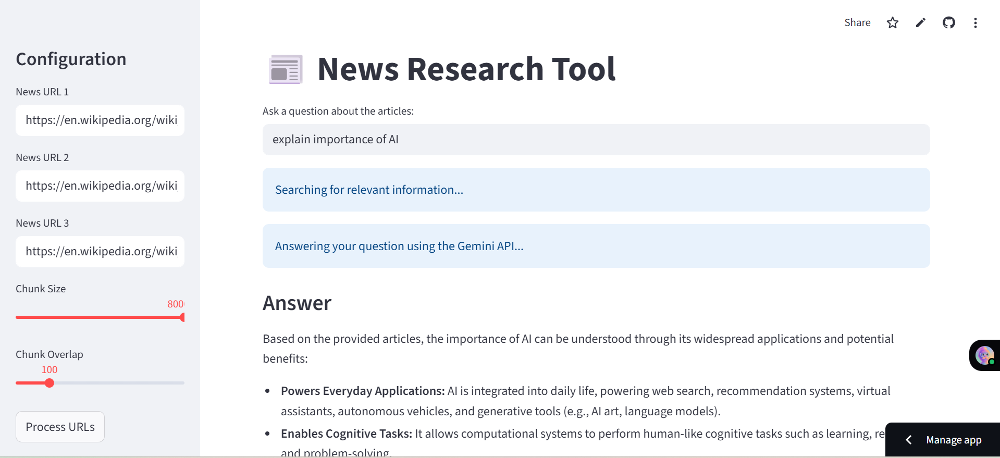
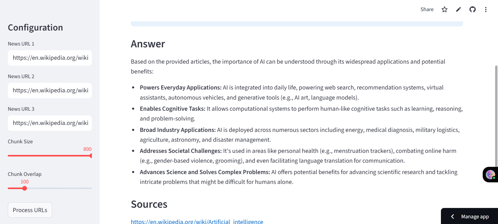

# 📰 News Research Tool
A web app for intelligent news research that scrapes, summarizes, and answers questions from multiple articles using AI.

## 🖼 Preview

##  🔥 Features
✅ URL Processing: Easily input up to three news article links.

✅ Intelligent Summarization: Automatically fetches and summarizes article content using the Gemini API.

✅ Searchable Knowledge Base: Builds a local vector store from the summaries, enabling quick and accurate Q&A.

✅ Efficient Performance: Uses a multi-threaded approach for concurrent summarization to maximize speed and a robust retry mechanism for API calls.

✅ Secure API Key Management: Your Gemini API key is stored securely in secrets.toml and is never exposed in the code.

✅ Responsive and accessible design.

##  🚀 Tech Stack
Layer

Technology

Language

Python

Framework

Streamlit

AI/LLM

Gemini API

Web Scraping

BeautifulSoup & requests

Vector Store

faiss-cpu & sentence-transformers

Orchestration

langchain

##  📁 Project Structure
.
├── .streamlit/
│   └── secrets.toml  # Your API key
├── app.py            # The main application file
└── requirements.txt  # Project dependencies

##  📦 How to Run
### 🧪 Prerequisites
 Python 3.8+
 Gemini API Key

## ▶️ Run Locally
git clone [https://github.com/abisha312/your-repo-name.git](https://github.com/abisha312/your-repo-name.git)
cd your-repo-name
pip install -r requirements.txt
streamlit run app.py

The app will run at:
👉 http://localhost:8501

## 🧑‍💼 Author
### Abisha Eunice
🎓 CSE @ Sairam Institute of Technology
📧 a.abishaeunice@gmail.com
🌐 Portfolio

### 📄 License
This project is licensed under the MIT License.

### 🌟 Support
If you find this project useful, feel free to ⭐ star the repo and share it!
